# INTRODUCCION A C#

## EJERCICIO 1
En el ejercicio 1 se nos pide que a 3 cubos se les asigne un color y un tamaño diferente a cada uno. 
Luego hacer que uno de los cubos cambie el tamaño y que otro cambie la posición. 

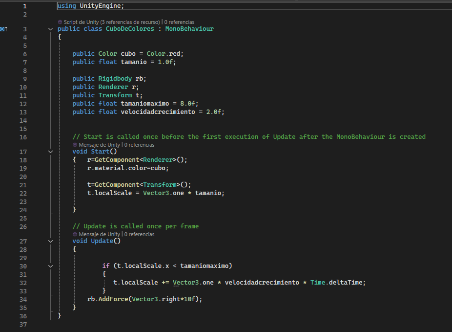

Creé como variables el color del cubo indicando que por defecto sea rojo y una variable float para el tamaño. Así, también coloque variables apra el rigidbody, transform y renderer. En Strat obtuve así el color rojo y el tamaño que le puse por defecto.

Para cambiarlo, creé acciones para el transform y el rigidbody. Active el transform de uno de los cubos en el inspector, y a otro cubo le hice lo mismo pero con el rigidbody.Si el tamaño es menos al valor de la variable de tamaño máximo que puse, este crecerá hasta ese tamaño. Al cubo con rigidbody activado simplemente lo desplacé a la derecha con un valor de 10.

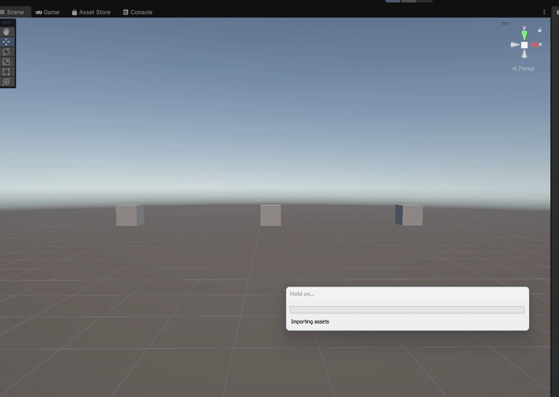

## EJERCICIO 2 Y 3
Simplemente agregué un cubo a la escena el cuál tiene que moverse en base a las teclas seleccionadas. 

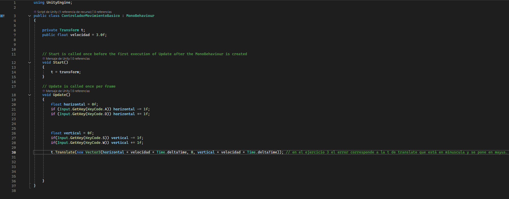

Variable transform y la velocidad a la que se moverá. Luego, le asigné las teclas en base al valor horizontal 0. De este modo, si va a la derecha se añade 1 de valor, y si va a la izquierda se le quita 1. Lo mismo para ir en vertical (para adelante y para detrás). Puse Time.deltaTime para que sea independiente a los FPS que pueda generar cada ordenador. 

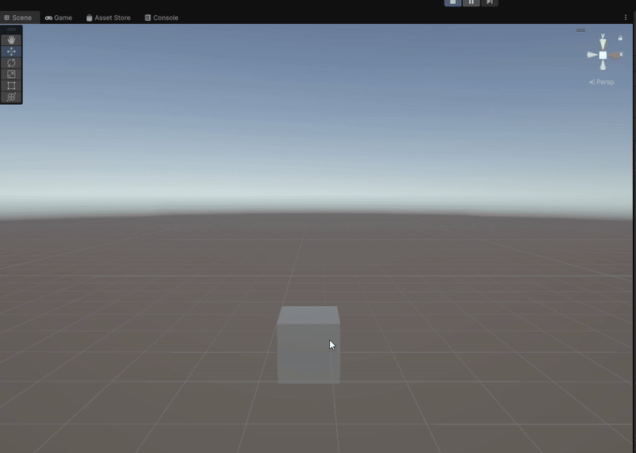

Para el ejercicio 3, al escribir la instrucción  transform.translate(2,1,1),daba error. Sin emabrgo, el error es que translate está mal escrito para el código. La T del comienzo es en mayúscula. 

## EJERCICIO 4
Aqui hay quen identificar un error de ejecución al inicializar una variable. El cubo no cambiaba de coor debido a que la sentencia rend = GetComponent<Renderer>(); estaba incluida como un comentario

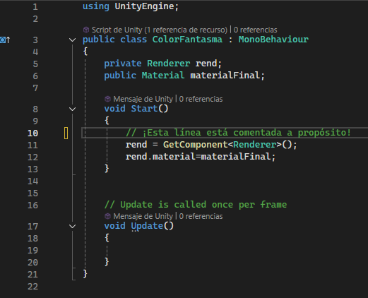

## EJERCICIO 5
Hay que identificar un error lógico donde una variable tiene un valor incorrecto. El colorEsperado aigna un valor incorrecto porque lo que esa linea de código hay que quitarla. 

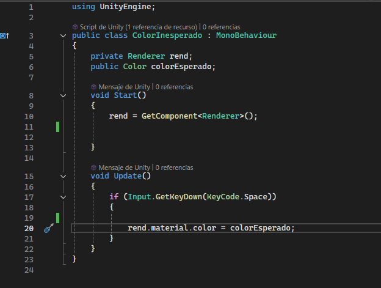

## EJERCICIO 6
En el primer apartado hay que crear un array para asignar los cubos. De esta forma, los colores de los cubos tienen que cambiar el color de forma sucesiva.

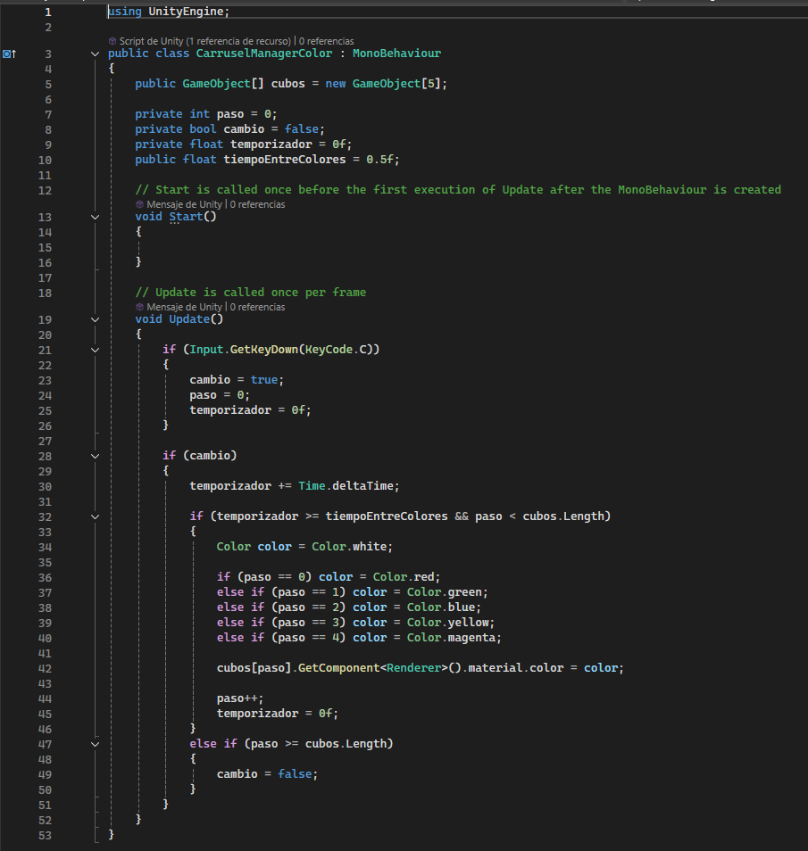

Para ello se crean variables de paso (etapas del proceso), otra de cambio, una del temporizador para alterar la velocidad entre los cubos y otra de tiempo en el que cada cubo se transforma. Si pulso la letra C, el cambio se inicia colocandose en el paso 0 y el temporizador en 0. Si el temporizador es mayor o igual que el tiempo entre los cubos y el número de pasos es menor a la cantidad de cubos que hay en el array, se cambia el color hasta que las etapas sean más o igual que la cantidad de cubos. 

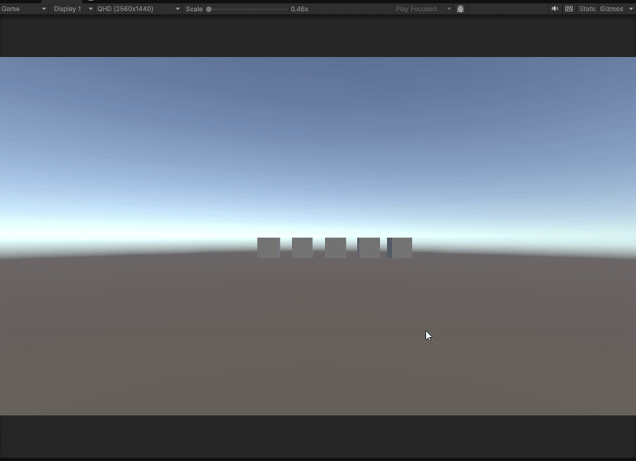

Para el tamaño se realiza un código similar, con la diferencia que en vez de cambiar el color, se transforma el tamaño aumentando en todas las direcciones de escala 1.5.

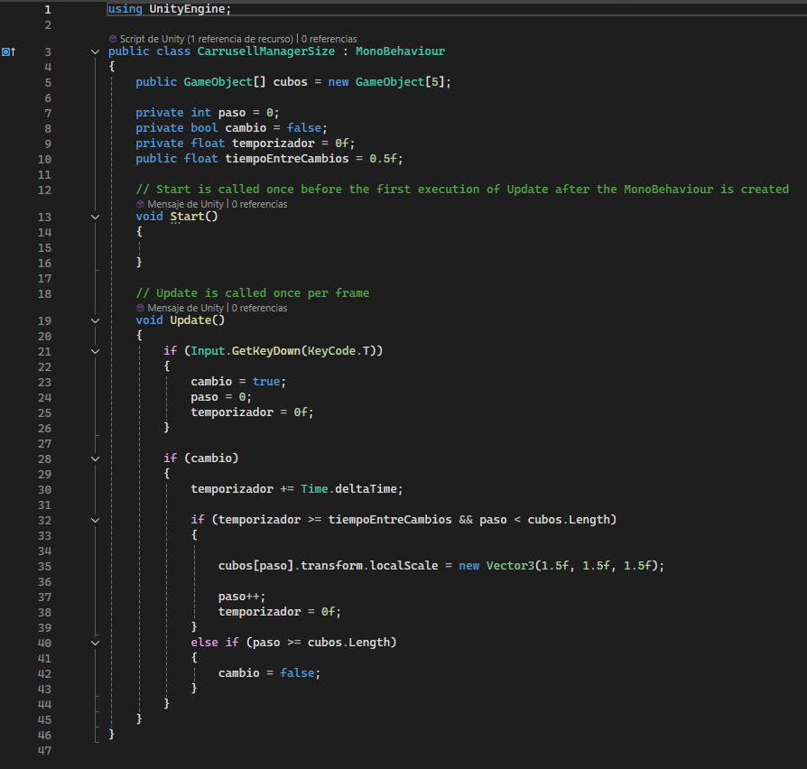

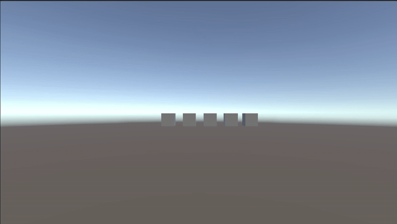

Por último,se pide una clase que cambie el color si pulso Space y el tamaño si pulso K. Como antes tenía seleccionados las teclas C para el color y T para el tamaño, pues las cambio por Space y K.

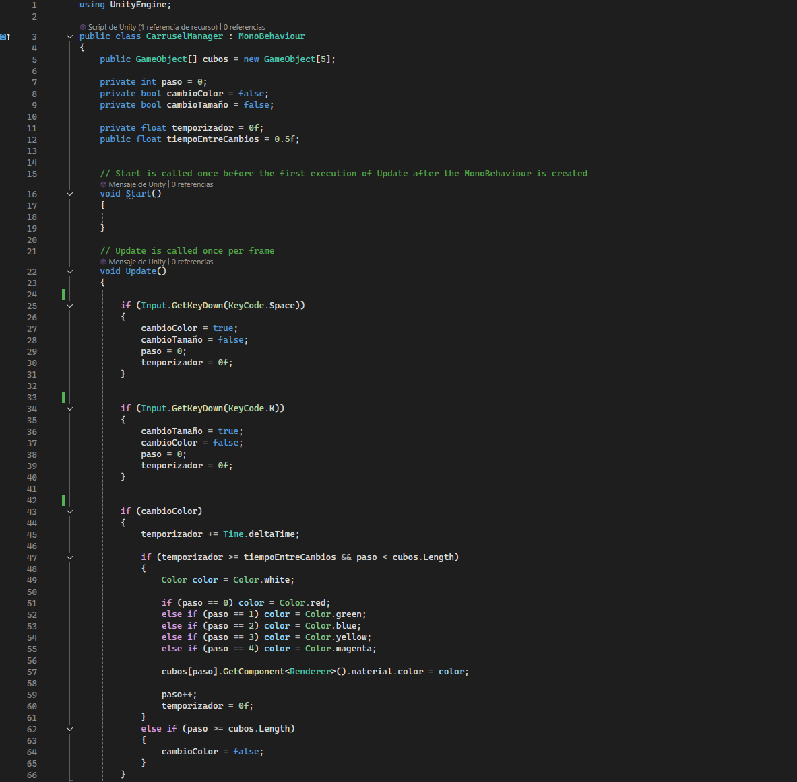
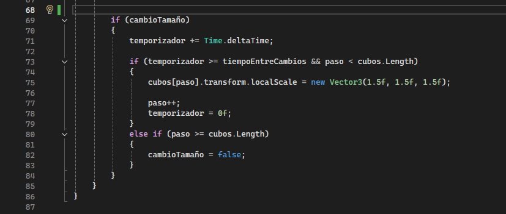

Para este Script simplemente uní los dos códigos previos en uno solo. 

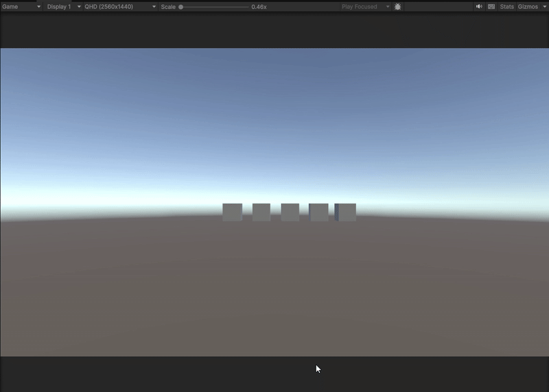

